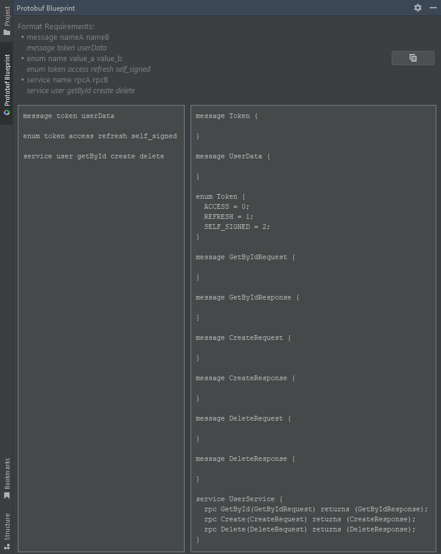
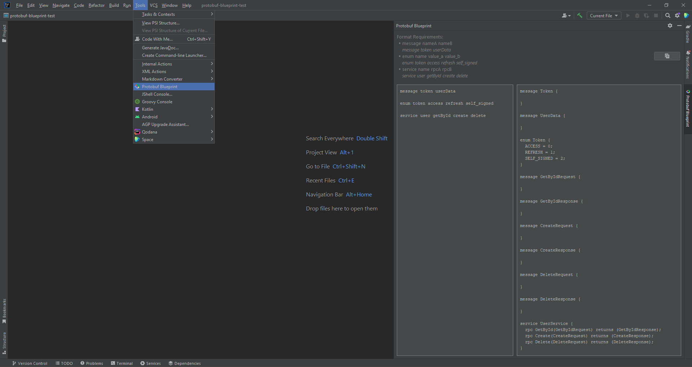

[](https://plugins.jetbrains.com/plugin/21792-protobuf-blueprint)
[](https://plugins.jetbrains.com/plugin/21792-protobuf-blueprint)

<a href="https://www.buymeacoffee.com/numq"></a>


<!-- Plugin description -->
**Protobuf Blueprint** is an Intellij Idea plugin that allows you to generate *Protocol Buffers* code using simple
format.
<!-- Plugin description end -->



## Installation

- Using IDE built-in plugin system:

  <kbd>Settings/Preferences</kbd> > <kbd>Plugins</kbd> > <kbd>Marketplace</kbd> > <kbd>Search for "Protobuf
  Blueprint"</kbd> >
  <kbd>Install Plugin</kbd>

- Manually:

  Download the [latest release](https://github.com/numq/protobuf-blueprint-plugin/releases/latest) and install it manually
  using
  <kbd>Settings/Preferences</kbd> > <kbd>Plugins</kbd> > <kbd>⚙️</kbd> > <kbd>Install plugin from disk...</kbd>

## Usage

1. Go to <b>Tools -> Protobuf Blueprint</b>  to open plugin tool window.
2. Follow the format hint in the plugin tool window to generate the code.

### Format Requirements:

> Break the line to complete the input.

Message:
> Use *PascalCase* for **message names**.

```message messageName messageName messageName```

Enum:
> Use *PascalCase* for **enum name** and *CAPITALS_WITH_UNDERSCORES* for **enum values**.

```enum enumName enum_value enum_value enum_value```

Service:
> Use *PascalCase* for **service name** and **rpc names**.

```service serviceName rpcName rpcName rpcName```


