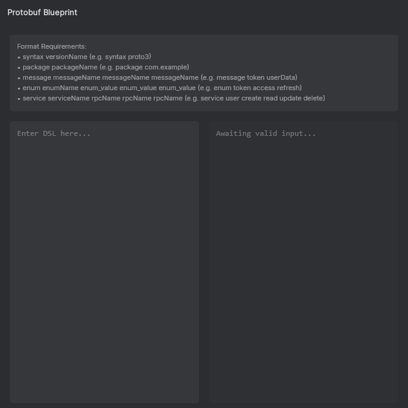
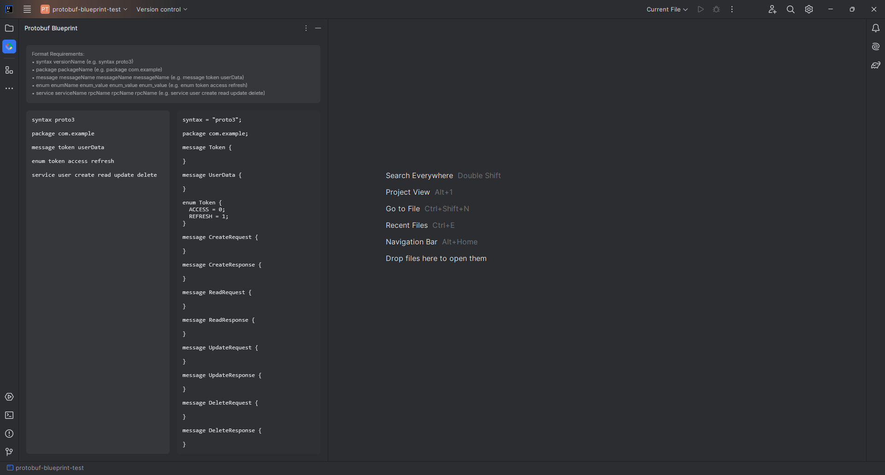

[](https://plugins.jetbrains.com/plugin/21792-protobuf-blueprint)
[](https://plugins.jetbrains.com/plugin/21792-protobuf-blueprint)

<p align="center""></p>

<p align="center">
<!-- Plugin description -->
Protobuf Blueprint is an Intellij Idea plugin that allows you to generate Protocol Buffers code using simple
format.
<!-- Plugin description end -->
</p>

<p align="center""></p>

## Installation

- Using IDE built-in plugin system:

  <kbd>Settings/Preferences</kbd> > <kbd>Plugins</kbd> > <kbd>Marketplace</kbd> > <kbd>Search for "Protobuf
  Blueprint"</kbd> >
  <kbd>Install Plugin</kbd>

- Manually:

  Download the [latest release](https://github.com/numq/protobuf-blueprint-plugin/releases/latest) and install it manually
  using
  <kbd>Settings/Preferences</kbd> > <kbd>Plugins</kbd> > <kbd>⚙️</kbd> > <kbd>Install plugin from disk...</kbd>

## Usage

1. Go to <b>Tools -> Protobuf Blueprint</b>  to open plugin tool window.
2. Follow the format hint in the plugin tool window to generate the code.

### Format Requirements:

> Break the line to complete the input.

Message:
> Use *PascalCase* for **message names**.

```message messageName messageName messageName```

Enum:
> Use *PascalCase* for **enum name** and *CAPITALS_WITH_UNDERSCORES* for **enum values**.

```enum enumName enum_value enum_value enum_value```

Service:
> Use *PascalCase* for **service name** and **rpc names**.

```service serviceName rpcName rpcName rpcName```



___

<p align="center">
  <a href="https://numq.github.io/support">
    
  </a>
  <br>
  <a href="https://numq.github.io/support" style="text-decoration: none;">
    <code><font color="#bb9af7">numq.github.io/support</font></code>
  </a>
</p>
